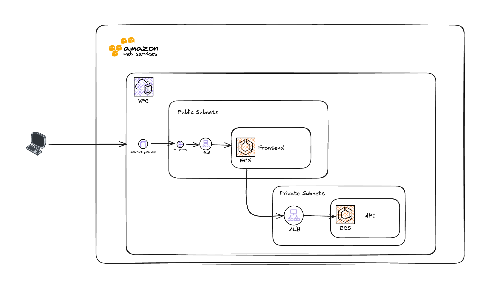

# infra-coding-challenge

This project provisions the infra necessary to run two services on AWS. The services are defined in `src/infra-api` and `src/infra-web`

Requirements:

* This infrastructure is a production quality infrastructure.
* The coding exercise is to run this environment in AWS.
* We are looking for an infrastructure-as-code (IaC) solution using Pulumi.
* You are free to architect the infrastructure as you see fit. The final goal is to run both services (Web and API) on AWS. We are leaving all the details to you.
* Be mindful of security best practices. The API is not a public API, and it is only accessed by Web UI.
* Only the web UI should be accessible through the internet (port 80)
* Tag all the environment resources for auditing purposes.

The project was created with a starter set of files which defined the services as well as a docker-compose file which showed the structure of the services.
This project uses the Pulumi Crosswalk for AWS which does a lot of work in the background such as allocating subnets, routing tables, NAT gateways and an internet gateway.
The code allocates the following resources:
* VPC
* 2 ECR Repos
* 1 ECS Cluster
* 2 ECS Services
* 2 Application Load Balancers
It defines a security group to allow full communications between the services and load balancers. 

The `Dockerfile` in each service was modified slightly to build using the current directory rather than expecting to be run from the parent directory. 



## Optimizations not implemented
* The security groups may be optimized to reduce scope to allow only connections on the service ports and 443 to allow the services to pull their images from ECR
* The tagging could be performed using a policy as described [here](https://www.pulumi.com/blog/automatically-enforcing-aws-resource-tagging-policies/)

## Provisioning
To provision the stack change to the `src` directory and run
```
pulumi up 
```
To deprovision the stack run
```
pulumi down
```

### Assumptions
* This was developed on a laptop running MacOS with Apple silicon. This is why dockerBuild is used. If running on intel hardware the functions creating `apiImage` and `webImage` starting on this [line](https://github.com/tokenfemale/infra-coding-challenge/blob/121e05082d683d57d07acb898d424a5dc34f417c/src/index.ts#L32) may be commented out and replaced by adding:
```
const apiImage = new awsx.ecr.Image("api-image", {
    repositoryUrl: apiRepo.url,
    context: "./infra-api",
    platform: "linux/amd64",
});

const webImage = new awsx.ecr.Image("web-image", {
    repositoryUrl: webRepo.url,
    context: "./infra-web",
    platform: "linux/amd64",
});
```
* If running on apple silicon initialize a dockerbuild setup by first logging into docker with an account which has buildcloud enabled and provisioning a builder called `my-cool-builder`
This can be done by running the following commands:
```
docker login
docker buildx create --driver cloud timelinelin/my-cool-builder
```
* It is assumed this is being run on an environment configured with AWS credentials which have permissions to provision resources